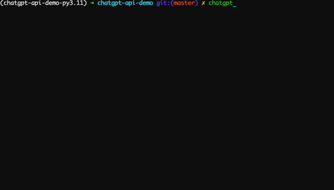

# ChatGPT-API-Demo

This repository is a demo for OpenAI's ChatGPT API usage in Python.



## Installation

You must have Python >= 3.8 installed to run this app.

Goto the [Release](./releases) page, download the latest `.whl` package, and run `pip install ./chatgpt_api_demo-0.0.2-py3-none-any.whl` to install.

## Setup

Visit [this link](https://platform.openai.com/account/api-keys) to generate your own **secret API key**. 

## Run

1. Set the environment variable `OPENAI_API_KEY` with your API key.

```
$ export OPENAI_API_KEY="you-openai-api-key" # for MacOS or Linux
$ set OPENAI_API_KEY="you-openai-api-key" # for Windows CMD
$ $env:OPENAI_API_KEY="you-openai-api-key" # for Windows Powershell
```

2. Start the app.

```
$ chatgpt # then you can chat with ChatGPT
$ chatgpt --disable-stream # disable stream-style output and display the result with Markdown
```
